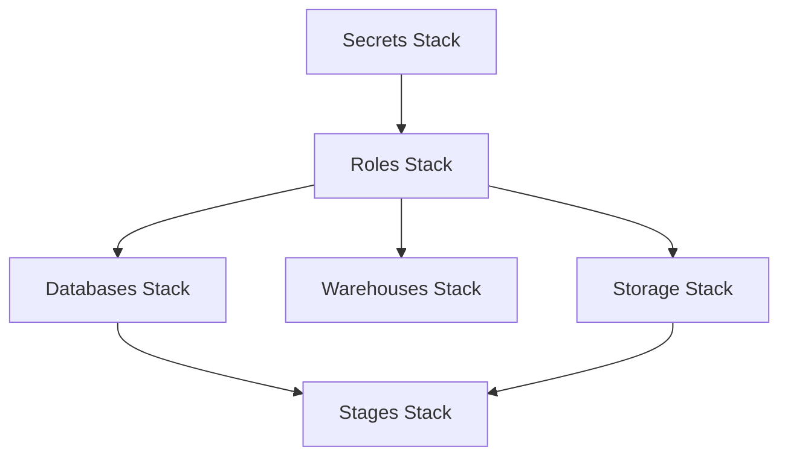

# Stack Architecture

Our infrastructure is organized into logical stacks that manage different aspects of the Snowflake data platform.

## Stack Overview

### Secrets Management
Located in `stacks/secrets/`:
- Manages Snowflake credentials
- Handles secret rotation
- Provides secure access to credentials

### Snowflake Resources
Located in `stacks/snowflake/`:

1. **Databases** (`databases.py`)
   - Creates BRONZE, SILVER, GOLD, PLATINUM databases
   - Configures schemas within each database
   - Sets ownership and permissions
   - Dependencies: Roles stack (for ownership assignment)

2. **Roles** (`roles.py`)
   - Creates administrative role (HOID)
   - Sets up access roles (OWNER, RW, RO)
   - Configures functional roles
   - Establishes service roles
   - Dependencies: None (should be deployed first)

3. **Warehouses** (`warehouses.py`)
   - Creates compute warehouses
   - Configures size-specific settings
   - Manages auto-suspension and scaling
   - Dependencies: Roles stack (for warehouse access)

4. **Storage** (`storage.py`)
   - Creates storage integrations
   - Configures AWS S3 access
   - Manages IAM roles and policies
   - Dependencies: None (can be deployed independently)

5. **Stages** (`stages.py`)
   - Creates external and internal stages
   - Configures file formats
   - Sets up data loading locations
   - Dependencies: Storage stack, Databases stack

## Deployment Order

The stacks should be deployed in the following order:

1. Secrets Stack
   - Creates necessary AWS Secrets Manager secrets
   - Sets up initial rotation schedule

2. Snowflake Core
   1. Roles
   2. Databases
   3. Warehouses
   4. Storage
   5. Stages

## Configuration Structure

Each stack maintains its configuration in YAML files under its respective config directory:

```
stacks/
├── secrets/
│   └── config/
│       └── secrets.yaml     # Secrets configuration
└── snowflake/
    └── config/
        ├── admin.yaml       # Administrative settings
        ├── databases.yaml   # Database and schema definitions
        ├── roles.yaml       # Role hierarchy and permissions
        ├── warehouses.yaml  # Warehouse configurations
        ├── storage.yaml     # Storage integration settings
        └── stages.yaml      # Stage definitions
```

## Stack Dependencies



## Validation and Monitoring

Each stack includes validation steps to ensure proper deployment:

1. **Secrets Stack**
   - Verify secret creation
   - Test rotation configuration
   - Check access permissions

2. **Roles Stack**
   - Verify role hierarchy
   - Test grant relationships
   - Validate access patterns

3. **Databases Stack**
   - Confirm database creation
   - Verify schema creation
   - Test ownership assignments

4. **Warehouses Stack**
   - Verify warehouse creation
   - Test auto-suspension
   - Validate size configurations

5. **Storage Stack**
   - Verify integration creation
   - Test S3 access
   - Validate IAM roles

6. **Stages Stack**
   - Confirm stage creation
   - Test file format configurations
   - Verify loading capabilities