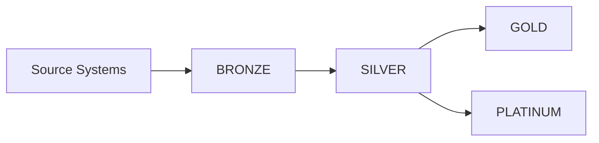

# Database Structure

Our Snowflake implementation follows the medallion architecture, organizing data into four main tiers: BRONZE, SILVER, GOLD, and PLATINUM. Each tier represents a different stage in the data processing pipeline.

## Medallion Architecture Overview



## Database Tiers

### BRONZE Database
Raw data landing zone that serves as the foundation of our data platform.

**Purpose:**
- Exact copy of source system data
- Audit and replay capabilities
- Historical preservation
- Source of truth

**Characteristics:**
- No transformations applied
- Retains original format
- Includes metadata columns
- Optimized for loading

**Schemas:**
```yaml
BRONZE:
  schemas:
    RAW:
      description: "Landing zone for raw data"
      retention_days: 90
    LANDING:
      description: "Temporary landing for data loads"
      retention_days: 1
```

### SILVER Database
Standardized and cleansed data ready for transformation.

**Purpose:**
- Data standardization
- Quality enforcement
- Common grain establishment
- Relationship mapping

**Characteristics:**
- Standardized data types
- Cleansed values
- Enforced constraints
- Consistent formats

**Schemas:**
```yaml
SILVER:
  schemas:
    CLEAN:
      description: "Cleansed and standardized data"
    CONFORM:
      description: "Conformed dimensions and facts"
```

### GOLD Database
Business-ready data optimized for analytics and reporting.

**Purpose:**
- Business metrics
- Reporting tables
- Dimensional models
- Aggregated views

**Characteristics:**
- Optimized for querying
- Business logic applied
- Aggregated metrics
- Star/snowflake schemas

**Schemas:**
```yaml
GOLD:
  schemas:
    ANALYTICS:
      description: "Analytics-ready tables"
    REPORTING:
      description: "Reporting views and marts"
```

### PLATINUM Database
Feature store and machine learning artifacts.

**Purpose:**
- Feature engineering
- Model inputs
- Prediction results
- Experiment tracking

**Characteristics:**
- ML-ready features
- Point-in-time correct
- Versioned features
- Model metadata

**Schemas:**
```yaml
PLATINUM:
  schemas:
    FEATURE_STORE:
      description: "ML feature repository"
    MODEL_REGISTRY:
      description: "Model metadata and versions"
    MODEL_METRICS:
      description: "Model performance metrics"
```

## Access Patterns

Each database tier has specific access patterns:

| Database  | Data Engineers | ML Engineers | Data Analysts | App Engineers |
|-----------|---------------|--------------|---------------|---------------|
| BRONZE    | RW            | RO           | -             | -             |
| SILVER    | RW            | RW           | RO            | -             |
| GOLD      | RW            | RO           | RO            | RO            |
| PLATINUM  | RO            | RW           | RO            | RO            |

## Configuration

Database configuration is managed in `stacks/snowflake/config/databases.yaml`:

```yaml
databases:
  BRONZE:
    description: "Raw data landing zone"
    retention_days: 90
    schemas:
      RAW:
        description: "Landing zone for raw data"
      LANDING:
        description: "Temporary landing for data loads"
        retention_days: 1

  SILVER:
    description: "Standardized and cleansed data"
    schemas:
      CLEAN:
        description: "Cleansed and standardized data"
      CONFORM:
        description: "Conformed dimensions and facts"

  GOLD:
    description: "Business-ready data"
    schemas:
      ANALYTICS:
        description: "Analytics-ready tables"
      REPORTING:
        description: "Reporting views and marts"

  PLATINUM:
    description: "ML feature store"
    schemas:
      FEATURE_STORE:
        description: "ML feature repository"
      MODEL_REGISTRY:
        description: "Model metadata and versions"
      MODEL_METRICS:
        description: "Model performance metrics"
```

## Best Practices

1. **Data Flow**
   - One-way flow through tiers
   - No skipping tiers
   - Clear transformation logic

2. **Schema Management**
   - Consistent naming conventions
   - Clear schema purposes
   - Documented dependencies

3. **Retention Policy**
   - Tier-appropriate retention
   - Cost-conscious storage
   - Compliance requirements

4. **Access Control**
   - Role-based access
   - Minimal required privileges
   - Regular access review