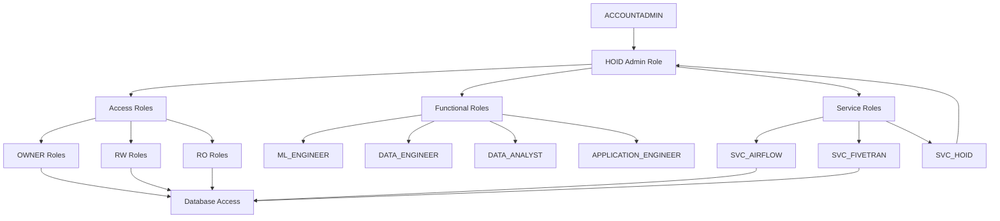

# Role Hierarchy and Access Control

Our Snowflake implementation uses a comprehensive role-based access control (RBAC) system with multiple layers of roles to ensure proper data governance and security.

## Role Hierarchy Overview



## Role Types

### 1. System Roles
Native Snowflake roles that form the foundation of our role hierarchy.

**ACCOUNTADMIN:**
- Snowflake's highest-level role
- Creates the admin role (HOID)
- Used only for initial setup and emergency access
- Should be protected with MFA and limited to minimal users

### 2. Administrative Role
Named HOID in our implementation (after Brandon Sanderson's mysterious character who transcends the various worlds of the Cosmere universe - a fitting metaphor for a role that oversees our entire data platform).

**Purpose:**
- Centralized management of all platform resources

**Responsibilities:**
- Creates and manages all other roles
- Owns the administrative database (COSMERE)
- Manages warehouse creation and resource monitors
- Controls cross-database access patterns

**Best Practices:**
- Never granted directly to users
- Used via service account (SVC_HOID) for automation
- Actions should be audited and logged
- Changes should follow change management process

### 3. Access Roles
Building blocks of our access patterns, following the pattern: `<ENV>_<DATABASE>_<LEVEL>`

**Key Principles:**
- Created per individual database (no cross-database permissions)
- Strictly scoped to their specific database
- Form the foundation for Functional and Service roles
- Never granted directly to users

Example structure:
```
BRONZE Database:
  - DEV_BRONZE_OWNER
  - DEV_BRONZE_RW
  - DEV_BRONZE_RO

SILVER Database:
  - DEV_SILVER_OWNER
  - DEV_SILVER_RW
  - DEV_SILVER_RO

[etc. for each database]
```

**OWNER Roles:**
- Purpose: Complete control over specific database
- Capabilities:
  - Full DDL rights (CREATE/ALTER/DROP)
  - Can modify database structure
  - Can grant/revoke access
- Usage: Typically granted to automation roles

**RW Roles:**
- Purpose: Data manipulation within database
- Capabilities:
  - Can read all data
  - Can modify data (INSERT/UPDATE/DELETE)
  - Can create temporary tables and views
  - Cannot modify database structure
- Usage: Granted to functional roles needing write access

**RO Roles:**
- Purpose: Read-only access to database
- Capabilities:
  - Can SELECT from tables and views
  - Can describe objects
  - No data modification rights
- Usage: Most common access pattern

### 4. Functional Roles
Represent job functions by combining appropriate Access Roles from different databases.

**Role Construction:**
- Built by granting specific Access Roles from each database
- Provides coherent access patterns across databases
- Enables job-specific data access

Example composition:
```sql
-- ML_ENGINEER role construction
GRANT DEV_BRONZE_RO TO ML_ENGINEER;  -- Read raw data
GRANT DEV_SILVER_RW TO ML_ENGINEER;  -- Create features
GRANT DEV_GOLD_RO TO ML_ENGINEER;    -- Read metrics
GRANT DEV_PLATINUM_RW TO ML_ENGINEER; -- Manage ML artifacts
```

**ML_ENGINEER:**
- Purpose: Support ML workflow from raw data to model deployment
- Access Pattern:
  - BRONZE_RO: Read raw data for feature engineering
  - SILVER_RW: Create and modify standardized features
  - GOLD_RO: Access business metrics
  - PLATINUM_RW: Manage ML features and models

**DATA_ENGINEER:**
- Purpose: Manage data pipeline and transformations
- Access Pattern:
  - All databases: RW
  - Needed for end-to-end data pipeline management
  - Responsible for data quality and transformation

**DATA_ANALYST:**
- Purpose: Business analysis and reporting
- Access Pattern:
  - SILVER_RO: Access clean, standardized data
  - GOLD_RO: Access business metrics and aggregates
- Focus on analysis rather than data manipulation

**APPLICATION_ENGINEER:**
- Purpose: Build data-powered applications
- Access Pattern:
  - GOLD_RO: Access to business-ready data
- Limited to specific schemas needed for applications

### 5. Service Roles
Automated process accounts that combine Access Roles for specific service needs.

**Role Construction:**
- Built using Access Roles like Functional Roles
- Scoped to specific service requirements
- May include warehouse access grants

Example composition:
```sql
-- SVC_AIRFLOW role construction
GRANT DEV_BRONZE_RW TO SVC_AIRFLOW;  -- Load raw data
GRANT DEV_SILVER_RW TO SVC_AIRFLOW;  -- Transform data
GRANT DEV_GOLD_RW TO SVC_AIRFLOW;    -- Create aggregates
GRANT USAGE ON WAREHOUSE LOAD_WH TO SVC_AIRFLOW;
```

**SVC_AIRFLOW:**
- Purpose: Data pipeline orchestration
- Access Pattern:
  - BRONZE_RW: Write raw data from sources
  - SILVER_RW: Perform transformations
  - GOLD_RW: Create aggregations
- Warehouse Access: LOAD_WH

**SVC_FIVETRAN:**
- Purpose: Data ingestion from external sources
- Access Pattern:
  - BRONZE_RW: Write raw data from source systems
- Warehouse Access: LOAD_WH

**SVC_HOID:**
- Purpose: Administrative automation
- Access Pattern:
  - HOID role access for automation
- Special Considerations:
  - Highest privilege service account
  - Used for automated administrative tasks
  - Requires strict audit logging
  - Should be highly restricted

## Configuration

Role configuration is managed in `stacks/snowflake/config/roles.yaml`. See the [roles.yaml](../../stacks/snowflake/config/roles.yaml) file for the complete configuration.

## Best Practices

1. **Role Management:**
   - Never grant access roles directly to users
   - Always use functional roles for user access
   - Regularly audit role memberships
   - Follow principle of least privilege
   - Document all custom role creation

2. **Service Accounts:**
   - Follow naming convention: SVC_<ENV>_<APP>
   - Create separate accounts for different environments
   - Grant minimum required permissions
   - Regular credential rotation (90 days recommended)
   - Implement detailed audit logging
   - Monitor for unusual activity patterns
   - Document purpose and access patterns
   - Use secrets management for credentials
   - Implement IP allowlisting where possible
   - Regular access review and cleanup
