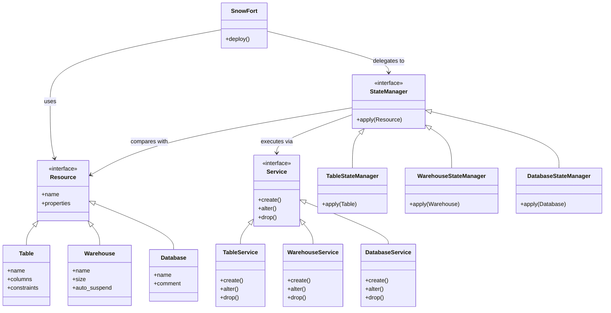
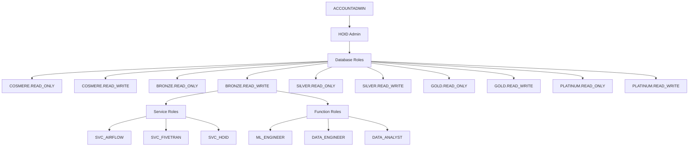

# Snowflake Data Platform Foundation

A scalable data platform implementation using Snowflake, with infrastructure managed through Python code. This project follows a declarative infrastructure-as-code pattern where Forts define desired state, StateManagers determine required changes, and Services execute those changes.

## Directory Structure

    snowflake-foundation/
    ├── deploy.py                # Main deployment script
    ├── requirements.txt         # Python dependencies
    ├── services/               # Core service implementations
    │   ├── table/             # Table service operations
    │   │   └── __init__.py    # Table service implementation
    │   └── __init__.py
    ├── specs/                  # Pydantic models for resource definitions
    │   ├── table/             # Table specifications
    │   └── __init__.py
    ├── state_managers/         # State management implementations
    │   ├── table/             # Table state management
    │   └── __init__.py
    ├── forts/                  # High-level infrastructure management
    │   ├── __init__.py
    │   ├── fort.py            # Base fort class
    │   ├── admin.py           # Administrative components
    │   └── medallion.py       # Data platform components
    ├── libs/                   # Shared libraries
    │   ├── __init__.py
    │   └── crypt.py           # Cryptography utilities
    └── tests/                 # Test suite
        ├── integration/       # Integration tests
        └── unit/             # Unit tests

## Core Components

### 1. Forts Layer
Forts define the desired state of infrastructure:

#### Base Fort (SnowFort)
The base fort class provides fundamental Snowflake operations including:
- Database creation and management
- Warehouse provisioning
- Role and privilege management
- AWS Secrets integration

#### Administrative Fort (AdminFort)
The AdminFort handles core platform administration:
- HOID administrative role creation
- Service account (SVC_HOID) setup with RSA authentication
- Administrative warehouse provisioning
- COSMERE database management

#### Medallion Fort (MedallionFort)
Implements the medallion architecture with four core layers:

    +-------------+  +-------------+  +-------------+  +-------------+
    |   BRONZE    |  |   SILVER   |  |    GOLD    |  |  PLATINUM   |
    |-------------|  |-------------|  |-------------|  |-------------|
    | Raw Data    |  | Cleansed &  |  | Business   |  |  ML-Ready   |
    | Landing     |  | Standard-   |  | Ready      |  |  Features   |
    | Zone        |  | ized Data   |  | Analytics  |  |  & Models   |
    +-------------+  +-------------+  +-------------+  +-------------+

### 2. State Management
StateManagers determine HOW to achieve desired state:
- `TableStateManager`: Manages table state operations
- `WarehouseStateManager`: Manages warehouse state operations
- `DatabaseStateManager`: Manages database state operations
- `SchemaStateManager`: Manages schema state operations
- `RoleStateManager`: Manages role state operations
- `UserStateManager`: Manages user state operations
- `FunctionStateManager`: Manages UDF/UDTF state operations
- `StreamStateManager`: Manages stream state operations
- `TaskStateManager`: Manages task state operations

Each StateManager:
- Compares current state with desired state
- Determines required operations (Create, Alter, Drop)
- Delegates execution to appropriate Services
- Handles operation sequencing and dependencies

### 3. Services Layer
Services handle the actual execution of operations:
- `TableService`: Executes table operations using Snowflake Python API
- `WarehouseService`: Executes warehouse operations
- `DatabaseService`: Executes database operations
- `SchemaService`: Executes schema operations
- `RoleService`: Executes role operations
- `UserService`: Executes user operations
- `FunctionService`: Executes UDF/UDTF operations
- `StreamService`: Executes stream operations
- `TaskService`: Executes task operations

Each Service:
- Implements specific database operations
- Handles error cases and rollbacks
- Provides operation-specific validation

### 4. Specifications
Direct usage of Snowflake Python API classes with minimal wrapping:
- `snowflake.core.table.Table`: For table definitions
- `snowflake.core.warehouse.Warehouse`: For warehouse definitions
- `snowflake.core.database.Database`: For database definitions
- `snowflake.core.schema.Schema`: For schema definitions
- `snowflake.core.role.Role`: For role definitions
- `snowflake.core.user.User`: For user definitions
- `snowflake.core.function.Function`: For UDF/UDTF definitions
- `snowflake.core.stream.Stream`: For stream definitions
- `snowflake.core.task.Task`: For task definitions

Wrappers only added when specific business logic is needed.

## Class Relationships



## Example: Creating a Complete D&D Database

Here's an example of creating a complete D&D database with tables, functions, and tasks:

```python
from forts import SnowFort
from state_managers import (
    DatabaseStateManager,
    SchemaStateManager,
    TableStateManager,
    FunctionStateManager,
    TaskStateManager
)
from snowflake.core import (
    Database,
    Schema,
    Table,
    TableColumn,
    Function,
    Task
)

class DnDFort(SnowFort):
    def deploy(self):
        # Define database
        db_spec = Database(
            name="dnd",
            comment="Dungeons & Dragons database"
        )
        
        # Define schemas
        core_schema = Schema(
            name="core",
            comment="Core game mechanics"
        )
        
        # Define tables
        class_spec = Table(
            name="classes",
            columns=[
                TableColumn(name="class_id", datatype="INTEGER", nullable=False),
                TableColumn(name="class_name", datatype="VARCHAR(50)", nullable=False),
                TableColumn(name="hit_die", datatype="VARCHAR(10)", nullable=False),
                TableColumn(name="primary_ability", datatype="VARCHAR(20)", nullable=False),
                TableColumn(name="saving_throws", datatype="VARCHAR(100)", nullable=False),
                TableColumn(name="proficiencies", datatype="VARCHAR(500)", nullable=False),
                TableColumn(name="created_at", datatype="TIMESTAMP_NTZ", default="CURRENT_TIMESTAMP()"),
                TableColumn(name="updated_at", datatype="TIMESTAMP_NTZ", default="CURRENT_TIMESTAMP()")
            ]
        )
        
        # Define functions
        roll_dice_spec = Function(
            name="roll_dice",
            arguments="sides INTEGER, count INTEGER",
            returns="INTEGER",
            body="RETURN FLOOR(RANDOM() * sides * count) + count;"
        )
        
        # Define tasks
        update_stats_spec = Task(
            name="update_character_stats",
            schedule="USING CRON 0 0 * * * UTC",
            sql="CALL update_character_stats();"
        )

        # Apply all specifications
        db_manager = DatabaseStateManager()
        schema_manager = SchemaStateManager()
        table_manager = TableStateManager()
        function_manager = FunctionStateManager()
        task_manager = TaskStateManager()
        
        # Apply in dependency order
        db_result = db_manager.apply(db_spec)
        if db_result.success:
            schema_result = schema_manager.apply(core_schema)
            if schema_result.success:
                table_result = table_manager.apply(class_spec)
                function_result = function_manager.apply(roll_dice_spec)
                task_result = task_manager.apply(update_stats_spec)
                
                if all(r.success for r in [table_result, function_result, task_result]):
                    print("D&D database successfully deployed")
                else:
                    print("Failed to deploy some components")
            else:
                print("Failed to create schema")
        else:
            print("Failed to create database")

# Deploy the fort
fort = DnDFort()
fort.deploy()
```

## Example: Adding Business Logic with Wrappers

Here's an example of when we might want to wrap Snowflake's classes to add business logic:

```python
from snowflake.core.table import TableColumn
from pydantic import BaseModel, validator

class DnDTableColumn(TableColumn):
    @validator('name')
    def validate_name(cls, v):
        if not v.islower():
            raise ValueError('D&D table column names must be lowercase')
        return v

    @validator('datatype')
    def validate_datatype(cls, v):
        if v not in ['INTEGER', 'VARCHAR', 'TIMESTAMP_NTZ']:
            raise ValueError('Invalid datatype for D&D table')
        return v

# Usage in a Fort
class DnDFort(SnowFort):
    def deploy(self):
        class_spec = Table(
            name="classes",
            columns=[
                DnDTableColumn(name="class_id", datatype="INTEGER", nullable=False),
                # ... other columns
            ]
        )
        # ... rest of deployment
```

## Role Hierarchy & Access Flow



## Cryptography Utilities

The `Crypt` class provides secure key management:
- RSA key pair generation (2048-bit)
- PKCS#8 format for private keys
- PEM encoding for storage
- Key loading and verification

## Warehouse Configurations

Each database tier has specific warehouse configurations:

    Size     Credits/Hour    Use Case
    ------------------------------------
    XSMALL   1              Development, light queries
    SMALL    2              Testing, medium workloads
    MEDIUM   4              Production, regular analytics
    LARGE    8              Heavy transformations
    XLARGE   16             Large-scale processing
    XXLARGE  32             Machine learning training
    XXXLARGE 64             Intensive operations

## Getting Started

### 1. Environment Setup

For development environment setup, please follow the instructions in the [vscode-devcontainer project](`../vscode-devcontainer/README.md`) first.

### 2. AWS Configuration

    # Configure AWS credentials
    aws configure

    # Create initial secret for ACCOUNTADMIN
    aws secretsmanager create-secret \
        --name snowflake/accountadmin \
        --secret-string '{
            "account": "your-account",
            "username": "your-username",
            "private_key": "your-private-key",
            "host": "your-host",
            "role": "ACCOUNTADMIN"
        }'

### 3. Initial Deployment

    # Deploy admin infrastructure
    python deploy.py --env dev --fort admin

    # Deploy medallion architecture
    python deploy.py --env dev --fort medallion

    # Or deploy everything at once
    python deploy.py --env dev --fort all

## Testing

Run tests using pytest:

    # Run all tests
    pytest

    # Run specific test suite
    pytest tests/integration/forts/test_dnd_fort.py
    pytest tests/unit/state_managers/test_table_state.py

## Good Practices

### 1. Forts
- Define WHAT you want, not HOW to get it
- Use Specs to define desired state
- Delegate state management to StateManagers
- Keep Forts focused on business logic

### 2. State Management
- Compare current and desired states
- Determine minimal set of operations
- Handle operation dependencies
- Manage operation sequencing

### 3. Services
- Focus on execution of specific operations
- Implement proper error handling
- Provide operation-specific validation
- Handle rollback scenarios

### 4. Specifications
- Validate all inputs
- Use type hints
- Document all fields
- Keep specifications simple

### 5. Role Management
- Never grant database roles directly to users
- Use functional roles for user access
- Follow principle of least privilege
- Regular audit of role memberships

### 6. Service Accounts
- Use RSA key authentication
- Regular key rotation (90 days)
- Minimal required privileges
- Detailed audit logging

### 7. Warehouse Usage
- Match warehouse size to workload
- Enable auto-suspend for cost control
- Use multi-cluster where appropriate
- Monitor credit consumption