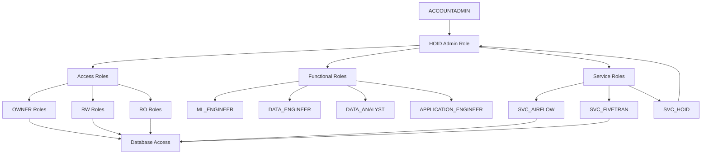

# Snowflake Data Platform Foundation

This project contains the foundational infrastructure for our Snowflake data platform, managed via AWS CDK.

> **Prerequisites**: Before proceeding, please follow the setup instructions in the `../vscode-devcontainer/README.md` first. This will ensure your development environment is properly configured.

## Initial Setup

### 1. Initialize CDK Project
Run the following command to create a new CDK project:
```bash
cdk init app --language python --profile localstack
```

This creates the initial project structure:
```
.
├── README.md
├── app.py
├── cdk.json
├── requirements.txt
├── foundation/
│   ├── __init__.py
│   └── foundation_stack.py
└── tests/
    └── unit/
        ├── __init__.py
        └── test_foundation_stack.py
```

- **.venv/**: Generated Python virtual environment directory. When using devcontainers, 
this virtual environment isn't needed and can be safely deleted.
- **app.py**: The entry point of your CDK application. This is where you instantiate your 
stack(s).
- **cdk.json**: Tells the CDK Toolkit how to run your app. Contains settings like:
  - `app`: Command to execute your CDK app
  - `watch`: Paths to monitor for changes
  - `context`: Environment-specific configuration values
- **requirements.txt**: Lists the Python packages required for your CDK infrastructure
- **requirements-dev.txt**: Additional packages needed for development (testing, linting, 
etc.)
- **source.bat**: A Windows-specific helper script that sets up the Python virtual 
environment. Not needed when using devcontainers or on non-Windows systems. You can safely 
delete it.
- **foundation_stack.py**: The main stack file where you define your AWS resources using 
CDK constructs

### 2. Project Restructuring
We'll reorganize the project to better support multiple components:
```
.
├── README.md                 # Project documentation
├── app.py                    # CDK app entry point
├── cdk.json                  # CDK configuration
├── requirements.txt          # Python dependencies
├── stacks/                   # CDK stack definitions (renamed from foundation/)
│   ├── __init__.py
│   ├── config/              # Stack configurations
│   │   ├── admin.yaml          # HOID role and COSMERE database settings
│   │   ├── databases.yaml      # Core database and schema structure
│   │   ├── access_roles.yaml   # RO/RW/OWNER role definitions
│   │   ├── functional_roles.yaml # ML_ENGINEER, DATA_ENGINEER, etc.
│   │   └── warehouses.yaml     # Warehouse configurations
│   ├── secret_stack.py      # Secrets management
│   ├── snowflake_stack.py   # Core Snowflake setup
│   └── warehouse_stack.py   # Warehouse management
└── lambdas/                 # Lambda function definitions
    └── rotation/            # Secret rotation lambda
        ├── config/          # Lambda configuration
        │   └── rotation_config.yaml
        ├── build.py         # Build script
        ├── index.py         # Lambda handler
        └── requirements.txt # Lambda dependencies
```

### 3. Understanding the Configuration

Before modifying the configuration files, it's important to understand how each component fits into the data platform:

#### Database Hierarchy
Our platform implements the medallion architecture:

1. **BRONZE** (Raw Data)
   - Landing zone for raw data
   - Exact copy of source system data
   - No transformations applied
   - Used for audit and replay capabilities

2. **SILVER** (Standardized Data)
   - Cleansed and conformed data
   - Standardized data types and formats
   - Basic data quality rules applied
   - Common grain for each entity

3. **GOLD** (Business Ready)
   - Business-level aggregations
   - Derived calculations
   - Commonly used metrics
   - Optimized for analytics queries

4. **PLATINUM** (ML Ready)
   - Feature engineering results
   - Model inputs and outputs
   - Prediction results
   - ML experiment tracking

#### Role Hierarchy

Our role hierarchy is designed to provide secure, scalable access management while maintaining the principle of least privilege. At its core is an administrative role (which we've named HOID, after Brandon Sanderson's mysterious character who transcends the various worlds of the Cosmere universe - a fitting metaphor for a role that oversees our entire data platform).



1. **System Roles** (Snowflake-provided)
   - ACCOUNTADMIN
     - Snowflake's highest-level role
     - Creates the admin role (HOID)
     - Used only for initial setup and emergency access
     - Should be protected with MFA and limited to minimal users

2. **Administrative Role**
   - Named HOID in our implementation
   - Purpose: Centralized management of all platform resources
   - Responsibilities:
     - Creates and manages all other roles
     - Owns the administrative database (COSMERE)
     - Manages warehouse creation and resource monitors
     - Controls cross-database access patterns
   - Best Practices:
     - Never granted directly to users
     - Used via service account (SVC_HOID) for automation
     - Actions should be audited and logged
     - Changes should follow change management process

3. **Access Roles** (per database)
   These roles form the building blocks of our access patterns:
   
   - <ENV>_<DATABASE>_OWNER
     - Purpose: Complete control over specific database
     - Capabilities:
       - Full DDL rights (CREATE/ALTER/DROP)
       - Can modify database structure
       - Can grant/revoke access
     - Usage: Typically granted to automation roles
   
   - <ENV>_<DATABASE>_RW
     - Purpose: Data manipulation within database
     - Capabilities:
       - Can read all data
       - Can modify data (INSERT/UPDATE/DELETE)
       - Can create temporary tables and views
       - Cannot modify database structure
     - Usage: Granted to functional roles needing write access
   
   - <ENV>_<DATABASE>_RO
     - Purpose: Read-only access to database
     - Capabilities:
       - Can SELECT from tables and views
       - Can describe objects
       - No data modification rights
     - Usage: Most common access pattern, granted to analyst roles

4. **Functional Roles** (granted to users)
   These roles represent job functions and aggregate appropriate access roles:

   - ML_ENGINEER
     - Purpose: Support ML workflow from raw data to model deployment
     - Access Pattern:
       - BRONZE_RO: Read raw data for feature engineering
       - SILVER_RW: Create and modify standardized features
       - GOLD_RO: Access business metrics
       - PLATINUM_RW: Manage ML features and models

   - DATA_ENGINEER
     - Purpose: Manage data pipeline and transformations
     - Access Pattern:
       - All databases: RW
       - Needed for end-to-end data pipeline management
       - Responsible for data quality and transformation

   - DATA_ANALYST
     - Purpose: Business analysis and reporting
     - Access Pattern:
       - SILVER_RO: Access clean, standardized data
       - GOLD_RO: Access business metrics and aggregates
     - Focus on analysis rather than data manipulation

   - APPLICATION_ENGINEER
     - Purpose: Build data-powered applications
     - Access Pattern:
       - GOLD_RO: Access to business-ready data
     - Limited to specific schemas needed for applications

5. **Service Roles** (automation accounts)
   These roles represent automated processes and services that interact with the data platform. They follow the naming convention: SVC_<ENV>_<APP>

   Example service roles (replace these with ones appropriate for your project):

   - SVC_AIRFLOW
     - Purpose: Data pipeline orchestration
     - Access Pattern:
       - BRONZE_RW: Write raw data from sources
       - SILVER_RW: Perform transformations
       - GOLD_RW: Create aggregations
     - Warehouse Access: LOAD_WH
     - Best Practices:
       - Limit to specific schemas needed for pipelines
       - Use separate service accounts for different pipeline types
       - Regular credential rotation

   - SVC_FIVETRAN
     - Purpose: Data ingestion from external sources
     - Access Pattern:
       - BRONZE_RW: Write raw data from source systems
     - Warehouse Access: LOAD_WH
     - Best Practices:
       - Restrict to BRONZE database only
       - One service account per integration type
       - Monitor for unusual access patterns

   - SVC_HOID
     - Purpose: Administrative automation
     - Access Pattern:
       - HOID role access for automation
     - Special Considerations:
       - Highest privilege service account
       - Used for automated administrative tasks
       - Requires strict audit logging
       - Should be highly restricted

Service Role Best Practices:
- Follow naming convention: SVC_<ENV>_<APP>
- Create separate accounts for different environments
- Grant minimum required permissions
- Regular credential rotation (90 days recommended)
- Implement detailed audit logging
- Monitor for unusual activity patterns
- Document purpose and access patterns
- Use secrets management for credentials
- Implement IP

Best Practices:
- Never grant access roles directly to users
- Always use functional roles for user access
- Regularly audit role memberships
- Follow principle of least privilege
- Document all custom role creation

### 4. Configuration Steps

1. Update `stacks/config/admin.yaml` with your HOID settings
2. Configure databases and schemas in `stacks/config/databases.yaml`
3. Define access roles in `stacks/config/access_roles.yaml`
4. Set up functional roles in `stacks/config/functional_roles.yaml`
5. Configure warehouses in `stacks/config/warehouses.yaml`

### 5. Deployment

1. Install dependencies:
```bash
pip install -r requirements.txt
```
**Note**: To add additional dependencies, for example other CDK libraries, just add
them to `requirements.txt` file and rerun the `pip install -r requirements.txt`
command.

2. Deploy the stacks:
```bash
cdk deploy --all
```

### 6. Validation

After deployment, verify:
1. HOID role creation
2. Database creation and permissions
3. Warehouse creation
4. Service account setup

## Useful commands

 * `cdk ls`          list all stacks in the app
 * `cdk synth`       emits the synthesized CloudFormation template
 * `cdk deploy`      deploy this stack to your default AWS account/region
 * `cdk diff`        compare deployed stack with current state
 * `cdk docs`        open CDK documentation

## Stack Architecture

Our infrastructure is organized into logical stacks:

### Secrets Management
Located in `stacks/secrets/`:
- Manages Snowflake credentials
- Handles secret rotation
- Provides secure access to credentials

### Snowflake Resources
Located in `stacks/snowflake/`:

1. **Databases** (`databases.py`)
   - Creates BRONZE, SILVER, GOLD, PLATINUM databases
   - Configures schemas within each database
   - Sets ownership and permissions

2. **Roles** (`roles.py`)
   - Creates administrative role (HOID)
   - Sets up access roles (OWNER, RW, RO)
   - Configures functional roles
   - Establishes service roles

3. **Warehouses** (`warehouses.py`)
   - Creates compute warehouses
   - Configures size-specific settings
   - Manages auto-suspension and scaling

4. **Storage** (`storage.py`)
   - Creates storage integrations
   - Configures AWS S3 access
   - Manages IAM roles and policies

5. **Stages** (`stages.py`)
   - Creates external and internal stages
   - Configures file formats
   - Sets up data loading locations

## Configuration Files

Each stack is configured via YAML files in its respective config directory:

### Secrets Configuration
```yaml
# stacks/secrets/config/secrets.yaml
secrets:
  snowflake:
    name: "snowflake-admin"
    description: "Snowflake administrative credentials"
    rotation:
      enabled: true
      interval_days: 90
```

### Snowflake Configuration
```yaml
# stacks/snowflake/config/storage.yaml
storage_integrations:
  RAW_DATA:
    s3_bucket: "raw-data-bucket"
    aws_role: "SnowflakeLoadRole"
    enabled: true

# stacks/snowflake/config/stages.yaml
stages:
  RAW_LANDING:
    database: BRONZE
    schema: RAW
    storage_integration: RAW_DATA
    url: "s3://raw-data-bucket/landing/"
```

Enjoy!
